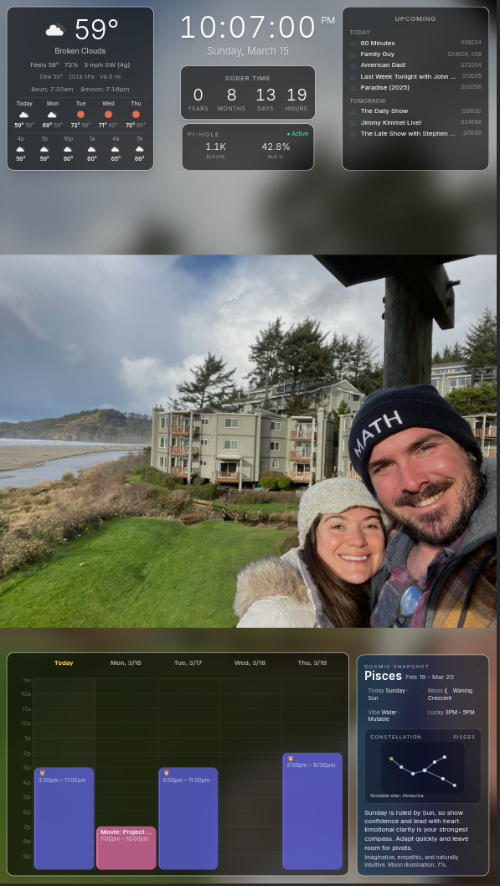
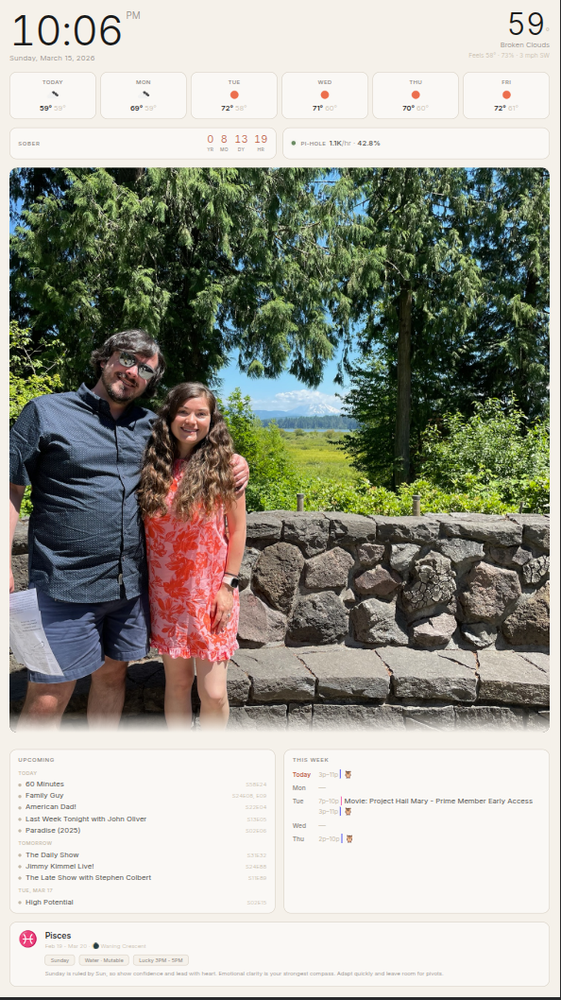
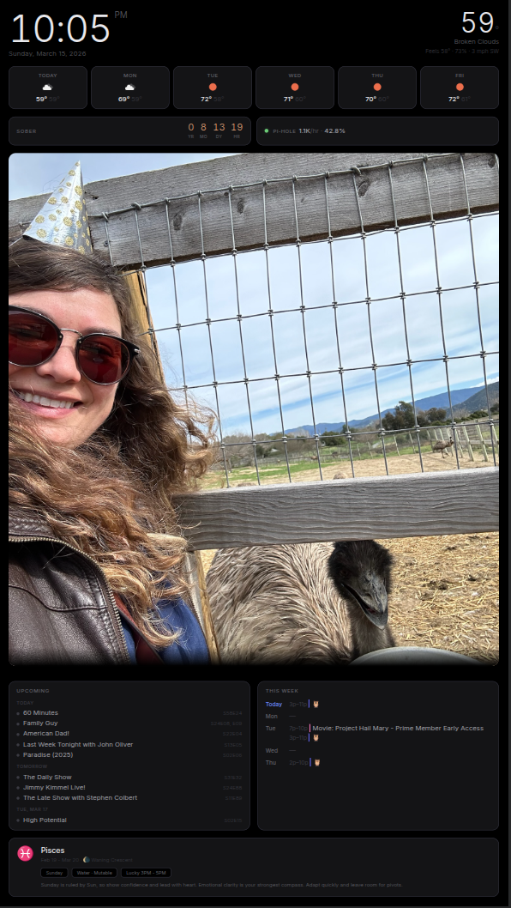
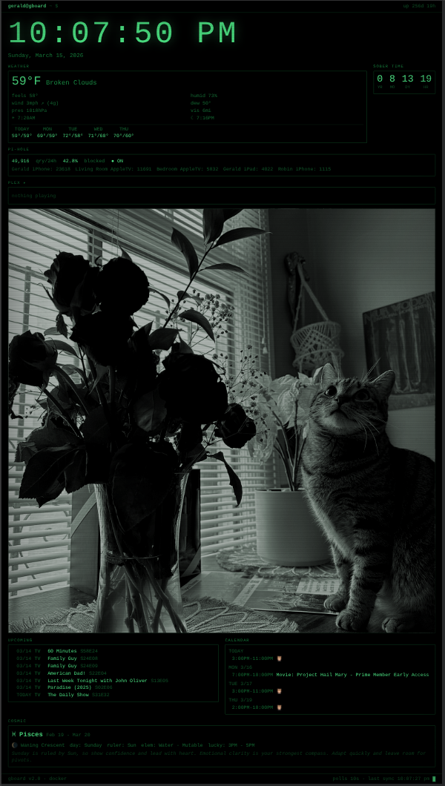
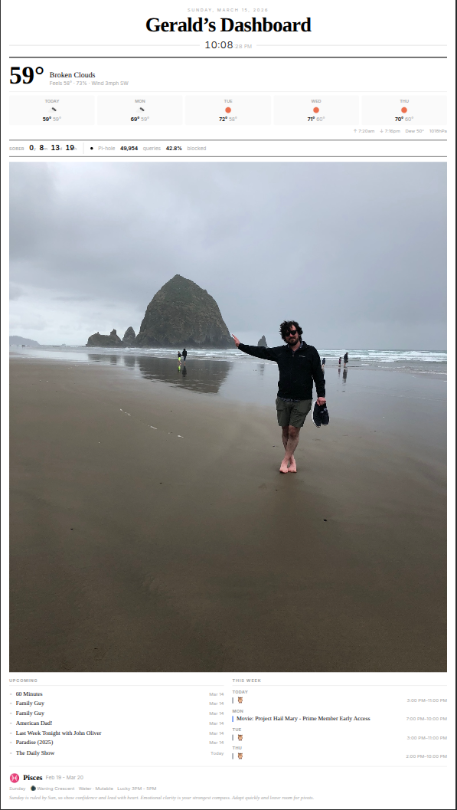
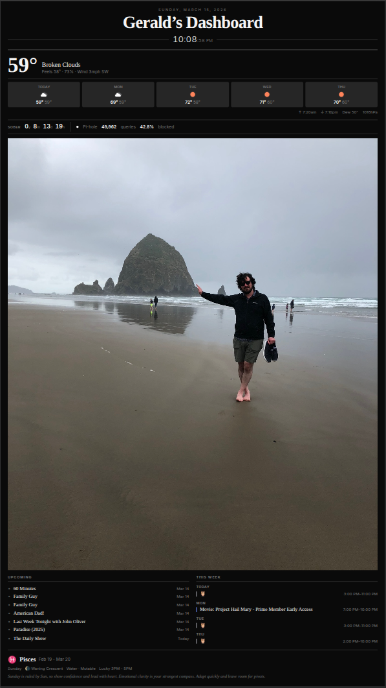
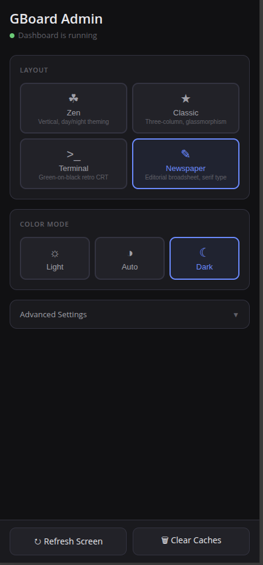

# GBoard


A self-hosted home dashboard — a Dakboard replacement. Runs in Docker, accessible via browser on your local network.

<p align="center">
  
</p>

## Features

- **Weather** — Current conditions, 4-day forecast, sunrise/sunset (OpenWeatherMap)
- **Radar Map** — Live precipitation radar overlay via RainViewer on CartoDB dark tiles
- **Clock & Date** — Live 12-hour digital clock with seconds
- **Astrology Snapshot** — Sun sign, moon phase, weekday ruler insights, constellation view
- **Sober Counter** — Years / months / days / hours since your sobriety date
- **Pi-hole Widget** — DNS blocking status and key stats
- **Upcoming Media** — Next 10 upcoming TV episodes (Sonarr) and movies (Radarr), grouped by day
- **Plex Now Playing** — Active streams with progress animation, hidden when idle
- **Calendar** — 7-day rolling view from iCloud shared CalDAV/ICS calendars
- **Photo Background** — Rotating iCloud shared album photos with blurred fill backdrop, served through a self-hosted [Thumbor](https://www.thumbor.org/) instance for on-demand resizing, WebP conversion, and face-aware smart cropping
- **Admin Panel** — Web-based settings management with layout/theme picker

## Themes

Four built-in layouts, switchable live from the admin panel. Zen and Newspaper support light/dark color modes (auto, manual, or based on sunrise/sunset).

<table>
  <tr>
    <td align="center"><strong>Zen (Light)</strong><br/></td>
    <td align="center"><strong>Zen (Dark)</strong><br/></td>
  </tr>
  <tr>
    <td align="center"><strong>Classic</strong><br/></td>
    <td align="center"><strong>Terminal</strong><br/></td>
  </tr>
  <tr>
    <td align="center"><strong>Newspaper (Light)</strong><br/></td>
    <td align="center"><strong>Newspaper (Dark)</strong><br/></td>
  </tr>
</table>

### Admin Panel

Manage layouts, color modes, and all settings from your phone or any browser at `/admin`.

<p align="center">
  
</p>

## Quick Start

```bash
cp .env.example .env
# Edit .env with your API keys, Plex token, iCloud URLs, etc.

docker compose up -d
```

Access the dashboard at `http://<your-machine-ip>:3000` and the admin panel at `http://<your-machine-ip>:3000/admin`.

## Environment Variables

| Variable | Description |
|---|---|
| `OPENWEATHER_API_KEY` | OpenWeatherMap API key (free tier) |
| `WEATHER_LAT` | Location latitude |
| `WEATHER_LON` | Location longitude |
| `SOBRIETY_DATE` | ISO 8601 sobriety start date (e.g. `2025-07-07T00:00:00`) |
| `VITE_SOBRIETY_DATE` | Same as above — required for frontend build |
| `PLEX_URL` | Plex server URL (e.g. `http://192.168.1.100:32400`) |
| `PLEX_TOKEN` | Plex authentication token |
| `ICAL_URLS` | Comma-separated iCloud CalDAV/ICS share URLs |
| `ICLOUD_ALBUM_URL` | iCloud shared album URL |
| `PIHOLE_URL` | Pi-hole base URL (e.g. `http://192.168.1.100`) |
| `PIHOLE_PASSWORD` | Pi-hole web/API password |
| `PIHOLE_CLIENT_ALIASES` | Optional comma-separated alias map (e.g. `192.168.1.22=iPhone,192.168.1.23=iPad`) |
| `SONARR_URL` | Sonarr base URL |
| `SONARR_API_KEY` | Sonarr API key |
| `RADARR_URL` | Radarr base URL |
| `RADARR_API_KEY` | Radarr API key |
| `PORT` | Frontend port (default: `3000`) |
| `BACKEND_PORT` | Backend API port (default: `3001`) |

### Getting your Plex token

In Plex Web, open any media item → `...` → `Get Info` → `View XML`. The token is the `X-Plex-Token` query param in the URL.

### Getting iCloud calendar URLs

In iCloud.com or Calendar app: share a calendar → enable public calendar → copy the URL. Change `webcal://` to `https://`.

### Getting the iCloud album URL

In Photos app on iPhone/Mac: select a Shared Album → share → copy link. Paste the full `https://www.icloud.com/photos/share/...` URL.

## Development

All building and testing runs inside Docker containers:

```bash
# Run tests
npm test

# Lint & format check
npm run lint

# TypeScript check
npm run typecheck

# Deploy (rebuilds containers)
npm run deploy
```

Or target frontend/backend individually: `npm run test:frontend`, `npm run lint:backend`, etc.

## Deploying Changes

```bash
# Frontend code changes: rebuild frontend first, then backend to trigger reload
npm run deploy:frontend

# Backend-only changes: just rebuild backend
npm run deploy:backend
```

Connected dashboards auto-refresh after deploy when backend startup time changes (`/api/version` poll every 10s).

## Architecture

```
Browser
   │
   ▼
Nginx  (port 3000)
  ├─ Serves React SPA
  ├─ /admin       ──▶ Admin panel (layout, theme, settings)
  ├─ /thumbor/*   ──▶ Thumbor (smart-crop, resize, WebP) ──▶ shared photos volume
  └─ /api/*       ──▶ Node.js API (port 3001)
                        ├─ /api/weather       ──▶ OpenWeatherMap
                        ├─ /api/weather/radar ──▶ RainViewer
                        ├─ /api/calendar      ──▶ iCloud CalDAV ICS
                        ├─ /api/pihole        ──▶ Pi-hole v6
                        ├─ /api/plex          ──▶ Plex (local LAN)
                        ├─ /api/media         ──▶ Sonarr / Radarr
                        └─ /api/photos        ──▶ iCloud shared album (downloads originals
                                                  to a Docker volume that Thumbor reads)
```

API keys and tokens are **never** exposed to the browser — all external API calls go through the backend.
